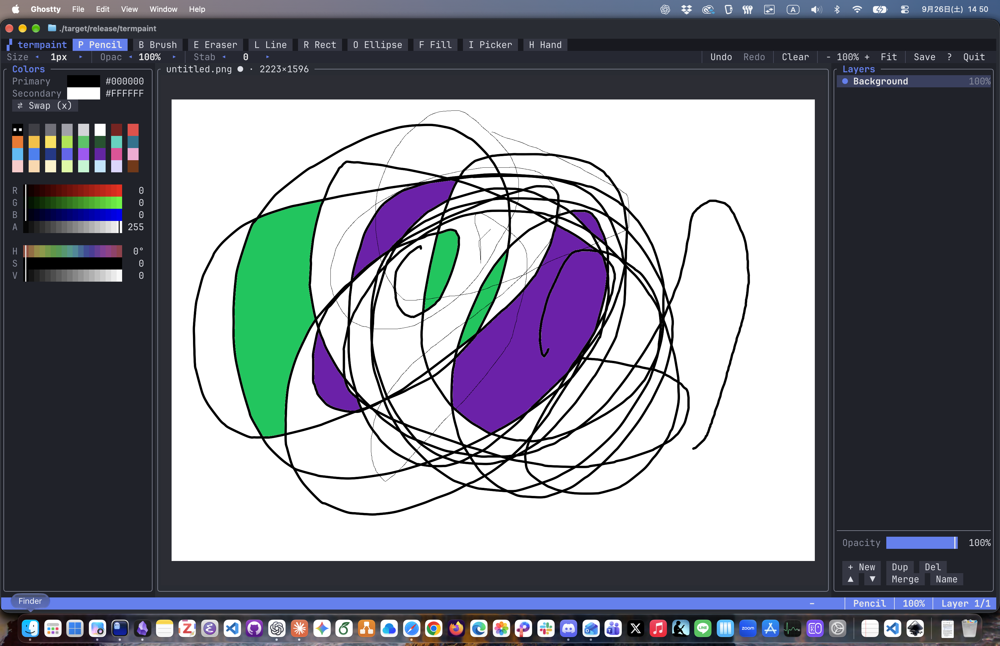

# termpaint

ターミナルで動くペイントソフトを Rust で試作しました（PoC）。
**Kitty Graphics Protocol**、**SGR-Pixels**、**Ratatui** を組み合わせています。

ブラシ・図形・塗りつぶし・レイヤー・Undo/Redo・PNG保存にも対応しています。



デモ動画：[assets/demo.mp4](assets/demo.mp4)

### UIとキャンバスの重ね方

ツールバー・パレット・レイヤー一覧は Ratatui で描いたテキストUIです。キャンバスだけが Kitty Graphics Protocol の画像です。画像の z-index を負の値にしてテキストセルの下に置いているので、ダイアログを開くとそのままキャンバスの手前に表示されます。

### タイル分割での差分更新

キャンバスは64pxほどのタイルに分割しています。描いて変化したタイルだけを送り直すので、ターミナル側で処理するピクセル数が大きく減ります（手元の計算では約369万px→約6,500px）。

### ピクセル単位のマウス入力

マウスは SGR-Pixels（DECSET 1016）でピクセル単位の座標を受け取ります。それを Catmull-Rom スプラインで補間しているので、ターミナルの中でも滑らかな線が引けます。

> [!NOTE]
> PoC（概念実証）としての実装です。動作確認は kitty でのみ行っています。

## 実行

```bash
cargo run --release -- [FILE.png] [--size 1280x800] [--tile 64]
```

kitty で実行してください（Ghostty・WezTermでも動くはずですが、未検証です）。ターミナルはピクセルサイズ（TIOCGWINSZ）を報告する必要があります。

## 描画の仕組み

| レイヤー | 内容 | z-index |
|---|---|---|
| Aboutダイアログのアイコン | 埋め込んだ `assets/icon.png` を表示サイズに縮小した画像。ポップアップ内の空白セルの上に配置 | `0`（最前面） |
| Ratatui のテキストセル（背景色あり） | パネル・ボタン・ポップアップ | テキスト層 |
| ブラシカーソル画像 | ブラシ径のリング。ピクセルオフセット（`X`,`Y`）で移動 | `-1073741825` |
| キャンバスのタイル群 | ドキュメントをパン・ズームして描いたビットマップを、セル境界に揃えた約64pxのタイルに分割したもの | `-1073741826` |

z-index が `INT32_MIN/2` より小さい画像は、**背景色がデフォルト以外のセルの下** に描かれます。そのためキャンバス領域はデフォルト背景の空セルのままにし、パネルやポップアップには背景色を付けています。こうするとヘルプや名前変更のダイアログは何もしなくてもキャンバスの手前に表示され、画像を消したり再配置したりする必要がありません。

Aboutダイアログのアイコンは逆に、ポップアップの背景より手前に出す必要があるので z-index `0`（テキストより手前）で配置し、その下のセルは空白にしておきます。大きさはテキスト6行分で、端末のセルサイズに合わせて termpaint 側で縮小してから送ります。ダイアログを閉じると配置だけを消し、画像データは次に開くときのために残します。

### 描画追随性能

ターミナルは画像を1つの単位として扱います。kittyの実装を見る限り、大きな画像の数ピクセルだけを書き換えても、ターミナル側では画像全体の合成、キャッシュへの書き戻し、GPUへの転送が発生すると考えられます（実機での計測はしていません）。そこでキャンバスを多数の小さな画像（タイル）に分割し、変化したタイルだけを `a=T` で送り直します。

| 処理量（1イベントあたり、2400×1536pxのキャンバス） | 以前（1枚の画像に `a=f` で差分書き換え） | 現在（64pxタイル） |
|---|---|---|
| ターミナルが処理するピクセル数 | 約369万px（画像全体） | 約6,500px |
| 送信バイト数 | 約0.4KB | 約1.2KB |
| termpaint側のCPU時間 | 0.02ms | 0.04ms |

- ストロークの先端は、次の入力点を待たずに現在のポインタ位置まで仮に描き、次のイベントで描き直します。これにより、スプライン補間による1サンプルの遅れがなくなります。
- スタビライザの初期値は0（オフ）です。手ぶれ補正が欲しいときだけ `s` で上げてください。
- 入力が途切れたらすぐに描画します。入力が連続して届いている間だけ、最短4ms間隔でまとめて描画します。
- ペイロードは zlib 圧縮（`o=z`）し、画面更新は同期出力（`?2026`）で囲みます。
- `F3` を押すと、フレームの処理時間、送信量、送り直したピクセル数をステータスバーに表示します。
- kittyの設定で `repaint_delay` と `input_delay` を小さくすると、さらに遅延が減ります（例：`repaint_delay 4`、`input_delay 0`）。

ベンチマークは次のコマンドで実行できます（`TILE=128` のように環境変数でタイルサイズを変えられます）。

```bash
cargo test --release bench_stroke -- --ignored --nocapture
```

## ブラシエンジン

- ストロークは、**Catmull-Rom スプライン** で入力点を補間します。スタビライザを使うと、指数平滑化した入力点で補間します。そのうえで一定間隔にダブを打ちます。
- ストロークごとにカバレッジマスク（最大値合成）を持ち、ストローク開始時のスナップショットに合成し直します。これにより、不透明度を下げてもダブの重なりで濃くならず、図形ツールのプレビューも「戻して描き直す」だけで済みます。
- 確定済みの線とは別に一時マスクを持ち、図形ツールのプレビューとフリーハンドの仮の先端をそこに描きます。
- Undo は変更された矩形の前後のピクセルを保存します。レイヤーの追加・削除・移動・結合も Undo できます。

## 操作

| キー／マウス | 動作 |
|---|---|
| `P` `B` `E` | 鉛筆（アンチエイリアスなし）／ブラシ／消しゴム |
| `L` `R` `O` | 直線／矩形／楕円 |
| `F` `I` `H` | 塗りつぶし／スポイト／手のひら |
| 左ボタン／右ボタン | プライマリ色／セカンダリ色で描画 |
| ホイール、`+` `-` `0` `1` | ポインタ位置を中心にズーム／フィット／100% |
| 中ボタンドラッグ、矢印キー | パン |
| `[` `]`、Ctrl+ホイール | ブラシサイズ |
| `{` `}`　`<` `>`　`s` `S` | 硬さ／不透明度／スタビライザ |
| `x` | プライマリ色とセカンダリ色を入れ替え |
| Ctrl+Z / Ctrl+Y（`u` / `U`） | Undo / Redo |
| `n` `N` `D` `M` `v` | レイヤーの新規／名前変更／削除／下と結合／表示切替 |
| `j` `k`　`J` `K` | レイヤーの選択／移動 |
| Delete | 現在のレイヤーをクリア |
| Ctrl+S | PNG に保存 |
| `?` | ヘルプ |
| `q` | 終了 |

パネルはマウスで操作できます。パラメータやスライダーの上でホイールを回すと値を調整でき、パレットの色を右クリックするとセカンダリ色に設定されます。マウスを乗せるとクリックできる要素がハイライトされます。ツールバー2段目の右側にあるコマンドは、端末の幅が足りないと優先度の低いもの（Clear → Save/?/Quit → ズーム）から省略されます。どれもキーボードで操作できます。

## 構成

```
src/
  main.rs      端末のセットアップ、SGR-Pixels、イベントループ（同期出力）
  kitty.rs     Kitty graphics の送信・配置・削除（分割送信＋zlib）
  tiles.rs     キャンバスのタイル分割と、変化したタイルだけの再送
  app.rs       状態、入力処理、ツール、キャンバス・カーソル・アイコン画像の同期
  ui.rs        Ratatui のレイアウト、ボタンなどのクリック判定領域
  document.rs  レイヤー、アルファ合成、表示用コンポジット
  stroke.rs    ダブ、スプライン、図形、フラッドフィル（カバレッジマスク方式）
  viewport.rs  パン・ズームの座標変換とビューのビットマップ生成
  history.rs   Undo / Redo
  io.rs        PNG の読み書き
  icon.rs      アプリのアイコン（assets/icon.png を埋め込み、Aboutダイアログ用に縮小）
```

アイコンは `assets/gen_icon.py` で生成した SVG（`assets/icon.svg`）から書き出しています。
